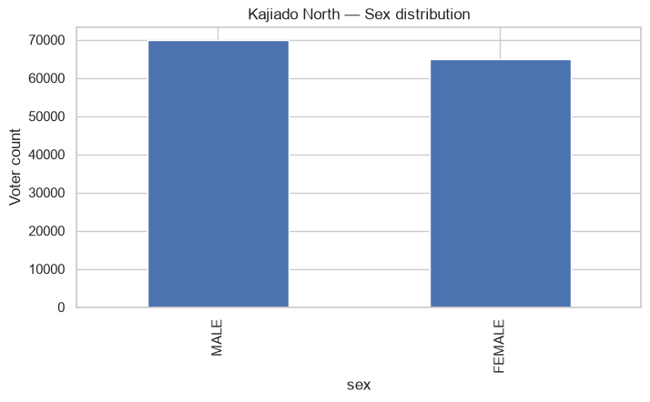
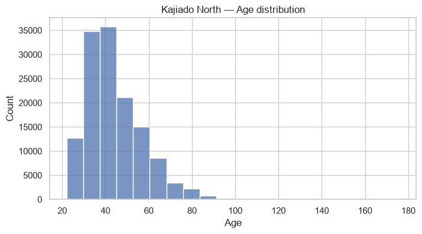
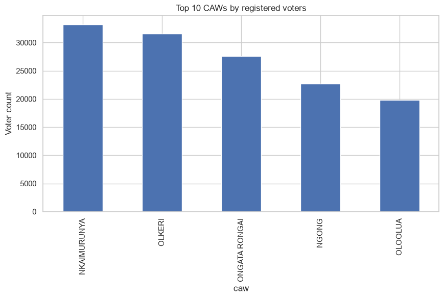
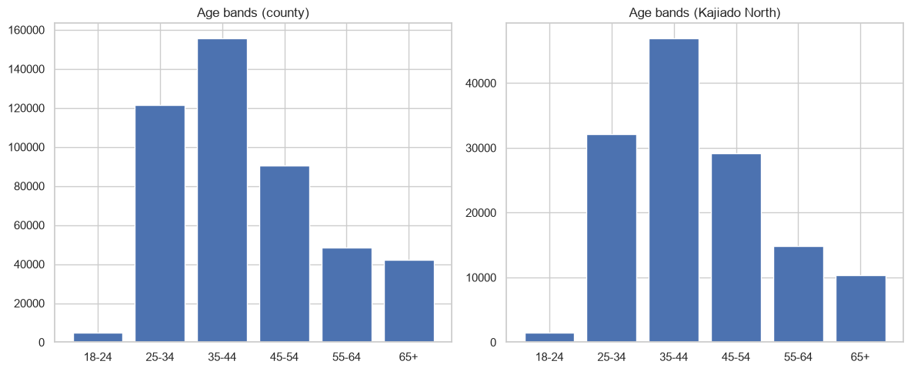
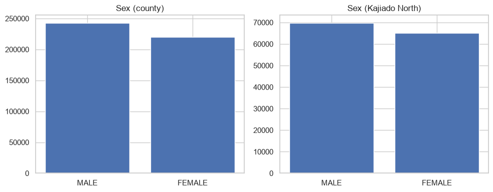

# Kajiado North Voter Analysis

Exploratory data analysis of voter registration records for **Kajiado North constituency**, benchmarked against Kajiado County as a whole. The workflow loads a raw voter register CSV, cleans and standardizes key fields, derives analytical columns (full name, birth year, age, age band), filters to the constituency of interest, and produces summary tables and visualizations.

## Data

- **Source file:** `034 - 034.csv (1).csv` — Kajiado County voter register
- **Total records (county-wide):** 463,273
- **Kajiado North subset:** 134,880 records (~29% of the county total)
- **Columns:** `county`, `constituency`, `caw`, `polling_center`, `polling_station`, `pstream`, `date_of_birth`, `fname`, `mname`, `sname`, `sex`, `id_passport_no`

## What the notebook does

1. **Import & setup** — loads pandas, numpy, matplotlib, seaborn; configures plot/output directories.
2. **Load raw data** — reads the CSV as strings (to avoid type-inference issues) and inspects shape/columns.
3. **Cleaning** — strips and upper-cases text fields, normalizes missing markers (`NULL`, `None`, blank), derives `full_name` from name parts, and parses `date_of_birth` into `birth_date`, `birth_year`, and `age` (age calculated relative to a 2026 reference year).
4. **Filter to Kajiado North** — isolates the constituency and runs QA: missing-value counts, duplicate ID checks, age distribution stats, and age-band bucketing (`<18`, `18-24`, `25-34`, `35-44`, `45-54`, `55-64`, `65+`).
5. **Summaries & plots** — sex distribution and top 10 Civic Administrative Wards (CAWs) by registered voters, with bar/histogram charts saved to `Visualizations/Plots/`.
6. **County-wide comparison** — a chunked (memory-efficient) pass over the full county dataset to compare Kajiado North against the rest of Kajiado on sex ratio and age-band distribution, with results exported to `analysis_outputs/`.

## Key findings

- **Kajiado North** accounts for **29.11%** of all registered voters in Kajiado County.
- **Sex split (Kajiado North):** Male 69,864 (51.8%) / Female 65,016 (48.2%) — closely tracking the county-wide split of 52.5% / 47.5%.
- **Age:** mean age ~44, median 41; bulk of voters fall in the 25–54 range. A small number of implausible ages (max 176) point to data-entry errors in `date_of_birth` worth flagging for cleanup.
- **Data quality:** no missing values in `date_of_birth`, `sex`, or `id_passport_no` for the Kajiado North subset, but 58 duplicate `id_passport_no` entries were detected.
- **Top CAWs by voter count:** Nkaimurunya, Olkeri, Ongata Rongai, Ngong, Oloolua — together representing the largest voter concentrations within the constituency.

## Visualizations

All charts below are generated by the notebook and saved to `Visualizations/Plots/`.

### Sex distribution — Kajiado North

Bar chart of registered voters by sex within Kajiado North. Male voters (69,864) slightly outnumber female voters (65,016), a ~3.6pp gap.

### Age distribution — Kajiado North

Histogram of voter ages. The distribution is right-skewed and peaks in the 30s–40s, consistent with a young-to-middle-aged voter base; a long thin tail extends into older age brackets.

### Top 10 CAWs by registered voters

Bar chart ranking Civic Administrative Wards (CAWs) within Kajiado North by voter count. Nkaimurunya, Olkeri, and Ongata Rongai lead, together accounting for a large share of the constituency's registered voters.

### Age band comparison — County vs. Kajiado North

Side-by-side bar charts comparing age-band distributions for the full county versus Kajiado North alone. The two shapes are broadly similar, with the 25–44 bands dominating in both.

### Sex share comparison — County vs. Kajiado North

Side-by-side bar charts comparing male/female voter counts for the county versus Kajiado North. Both scopes show a modest male majority, with Kajiado North's split slightly closer to even than the county's.

## Analysis outputs

Exported summary tables live in `analysis_outputs/`:

| File | Contents |
|---|---|
| `sex_distribution_comparison.csv` | Voter counts and percentage share by sex, for both County and Kajiado North scopes |
| `age_band_kajiado_north.csv` | Voter counts by age band (`<18` through `65+`) for Kajiado North |

**Sex distribution comparison**

| Scope | Category | Count | % |
|---|---|---|---|
| County | Male | 243,125 | 52.48% |
| County | Female | 220,148 | 47.52% |
| Kajiado North | Male | 69,864 | 51.80% |
| Kajiado North | Female | 65,016 | 48.20% |

**Age band distribution — Kajiado North**

| Age band | Count |
|---|---|
| <18 | 0 |
| 18–24 | 1,449 |
| 25–34 | 32,128 |
| 35–44 | 46,868 |
| 45–54 | 29,179 |
| 55–64 | 14,860 |
| 65+ | 10,396 |

## Repository structure

```
.
├── README.md
├── Visualizations/
│   └── Plots/
│       ├── kajiado_north_sex_distribution.png
│       ├── kajiado_north_age_distribution.png
│       ├── kajiado_north_top_caws.png
│       ├── age_band_comparison.png
│       └── sex_share_comparison.png
└── analysis_outputs/
    ├── sex_distribution_comparison.csv
    └── age_band_kajiado_north.csv
```

## Tech stack

Python, pandas, numpy, matplotlib, seaborn (Jupyter notebook environment)

## Notes / next steps

- Investigate and clean implausible ages (e.g., derived from invalid or placeholder `date_of_birth` values).
- Deduplicate the 58 records sharing an `id_passport_no`.
- Potential extensions: polling-station-level granularity, gender-by-age-band cross-tabs, and year-over-year comparison if historical registers become available.
